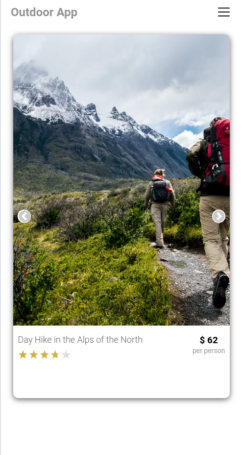

### Outdoor App

> Find your perfect outdoor experience

## Table of Contents

* [About the Project](#about-the-project)
  * [Built With](#built-with)
* [Setup](#setup)
* [Author](#author)
* [Show your Support](#show-your-support)
* [Acknowledgements](#acknowledgements)

<!-- ABOUT THE PROJECT -->
## About The Project

### Home

<p align="center">
  
</p>

### Home - Listings Page

<p align="center">
  
</p>

### Listing Details Page

<p align="center">
  
</p>

### Favourites Page

<p align="center">
  
</p>

The project is based on a mobile web app that contains listings of houses, apartments, rooms etc. That was the base idea for the project.
The original theme was just an example, for this project I decided to build an app that lists hosted outdoor activities.

On the Home page, when you first enter the app, you can see a short description of the app. Through there you can either sign in or sign up to access the listings.

When logged in, the Home page shows all of the listings, from there you can access the Listing Details page or the Favourites page.

In the Listing Details page you can see the full details for that activity - title, description, host, host rating, price of the activity and the location.

From the Details page you can also add that particular listing to your list of Favourites, or remove it.

#### The frontend of the app is built with React and Redux, and the backend is an API built with Ruby on Rails

Link to the Backend repository: [Outdoor API](https://github.com/ermin-cahtarevic/outdoor-api)

Live version of the project: [Outdoor App](https://outdoor-app.netlify.app/)

Project Link: [Outdoor App](https://github.com/ermin-cahtarevic/outdoor-client)


### Built With

*   `React`
*   `Redux`
*   `react-star-ratings` - [react-star-ratings](https://www.npmjs.com/package/react-star-ratings)
*   `react-slick` - [React Slick](https://react-slick.neostack.com/)
*   `react-loader-spinner` - [react-loader-spinner](https://www.npmjs.com/package/react-loader-spinner)
*   `react-icons` - [React Icons](https://react-icons.github.io/react-icons/)
*   `npm`
*   `CSS`
*   `ES6`

## Setup

```
git clone git@github.com:ermin-cahtarevic/outdoor-client.git
```
### Install dependencies

```
npm install
```

### Start Development Server

```
npm start
```
### Visit this link in your browser
```
http://localhost:3000/
```

### Run ESlint

```
npx eslint .
```
### Run Stylelint

```
npx stylelint "**/*.{css,scss}"
```

### Tests

Due to the time constraint I was not able to write the tests. 
That is one feature that I plan to implement in the future.

<!-- CONTACT -->
## Author

- Personal website: [ermin.dev](https://ermin.dev)
- Github: [@ermin-cahtarevic](https://github.com/ermin-cahtarevic)
- Twitter: [@ErminCahtarevic](https://twitter.com/ErminCahtarevic)
- Linkedin: [Ermin Cahtarevic](https://www.linkedin.com/in/ermincahtarevic/)

<!-- ABOUT THE PROJECT-->
## Show your support

Give a star if you like this project!

<!-- ACKNOWLEDGEMENTS -->
## Acknowledgements

* [Microverse](https://www.microverse.org/)
* Design idea by [Alexey Savitskiy on Behance](https://www.behance.net/alexey_savitskiy)
  * The design used for inspiration [Circle - Mobile app](https://www.behance.net/gallery/37706679/Circle-(Landing-page-Dashboard-Mobile-App))
* All of the images used for the project can be found on [Unsplash](https://unsplash.com/)